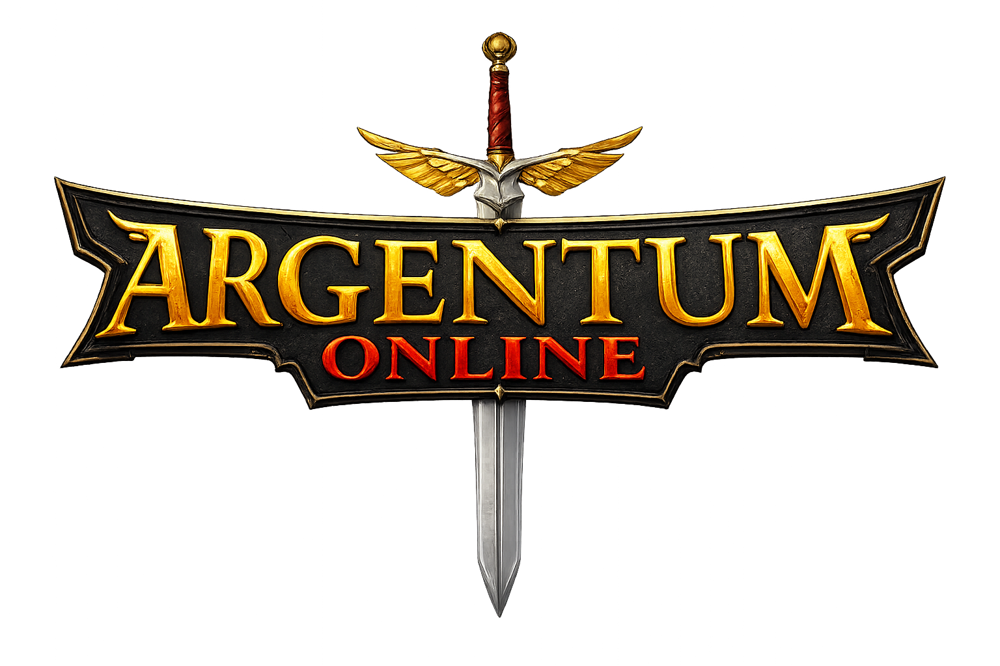

# ⚔️ Argentum Online - Taller de Programación I



Implementación de un MMORPG 2D estilo Argentum Online con arquitectura cliente-servidor.

## 👥 Autores

Proyecto desarrollado para **Taller de Programación I, Cátedra Veiga - FIUBA** por los alumnos:

- Leandro Rodrigo Pesa - [@leandropesa](https://github.com/leandropesa)
- Pedro Miguel - [@Drope37](https://github.com/Drope37)
- Weng Xu Marcos Tomas - [@wxmarcos](https://github.com/wxmarcos)

Correctora:
- Nathalia Encinoza - [@nathencinoza](https://github.com/nathencinoza)

---

## 🎥 Demo

<!-- Próximamente: video demostrativo del juego -->
*Próximamente.*

---

## 📑 Índice

- [Requisitos Previos](#-requisitos-previos)
- [Instalación del Sistema](#-instalación-del-sistema)
- [Ejecución (Sistema Instalado)](#-ejecución-sistema-instalado)
- [Desarrollo Local (Sin Instalación)](#-desarrollo-local-sin-instalación)
- [Multijugador en Red](#-multijugador-en-red)
- [Controles del Juego](#-controles-del-juego)
- [Comandos de la Consola](#-comandos-de-la-consola)
- [Herramientas de Desarrollo](#-herramientas-de-desarrollo)
- [Estructura del Proyecto](#-estructura-del-proyecto)
- [Características](#-características)

---

## 🔧 Requisitos Previos

- **Sistema Operativo**: Linux (Ubuntu/Xubuntu 24.04 recomendado)
- **Git**: Para clonar el repositorio
- **Compilador**: GCC con soporte C++20
- **CMake**: Versión 3.24 o superior

**Nota**: Las dependencias del sistema se instalan automáticamente mediante el instalador (`installer.sh`).

---

## 📦 Instalación del Sistema

El proyecto incluye un script de instalación que instala las dependencias, compila el juego, ejecuta los tests e instala los componentes en las ubicaciones estándar del usuario.

### Instalación Completa

```bash
chmod +x installer.sh
./installer.sh
```

Este script:
1. Actualiza el sistema e instala las dependencias necesarias
2. Compila el proyecto con CMake
3. Ejecuta los tests automáticamente con `ctest`
4. Instala binarios, configuraciones y assets en el sistema del usuario

**Dependencias instaladas:**
- **Build tools**: `build-essential`, `cmake`, `git`, `pkg-config`, `gdb`, `valgrind`, `clang-format`
- **SDL2**: `libsdl2-dev`, `libsdl2-image-dev`, `libsdl2-mixer-dev`, `libsdl2-ttf-dev`, `libsdl2-gfx-dev`
- **Audio**: `libopus-dev`, `libopusfile-dev`, `libxmp-dev`, `libfluidsynth-dev`, `fluidsynth`, `libwavpack-dev`, `wavpack`
- **Otros**: `libfreetype-dev`, `libyaml-cpp-dev`, y dependencias de X11/Wayland
- **SDL2pp** y **GoogleTest**: Se descargan y compilan automáticamente mediante CMake

### Ubicación de Archivos Instalados

Tras la instalación, los archivos se distribuyen en el directorio del usuario:

- **Lanzadores**: `~/.local/bin/argentum-{client,server}`
- **Binarios y assets**: `~/.local/share/argentum/`
  - `assets/` - Recursos gráficos y de audio
  - `data/` - Archivos de persistencia (jugadores, índice, clanes)
  - `config/` - Configuración del cliente
- **Configuraciones**: `~/.config/argentum/`
  - `config.toml` - Configuración del servidor y del juego
  - `client.toml` - Configuración del cliente

---

## 🚀 Ejecución (Sistema Instalado)

Después de instalar con `installer.sh`, asegurate de que `~/.local/bin` esté en tu `PATH` y ejecutá desde cualquier directorio:

### Servidor

```bash
argentum-server <PUERTO>
```

**Ejemplo**: `argentum-server 8080`

### Cliente

```bash
argentum-client
```

---

## 🔧 Desarrollo Local (Sin Instalación)

Para compilar y ejecutar localmente durante el desarrollo:

### 1. Instalar dependencias

Ejecutá el instalador una vez para tener todas las dependencias del sistema:

```bash
chmod +x installer.sh
./installer.sh
```

### 2. Compilar el proyecto

```bash
cmake -S . -B build -DCMAKE_BUILD_TYPE=Debug
cmake --build build -j$(nproc)
```

Para una compilación optimizada (release):

```bash
cmake -S . -B build -DCMAKE_BUILD_TYPE=Release
cmake --build build -j$(nproc)
```

### 3. Ejecutar localmente (desde el directorio raíz del proyecto)

```bash
./build/taller_server 8080   # Servidor (puerto como argumento)
./build/taller_client        # Cliente
./build/taller_tests         # Tests
```

> El cliente acepta argumentos opcionales para autocompletar el login:
> `./build/taller_client <nick> <raza> <clase>`

---

## 🌐 Multijugador en Red

El juego soporta múltiples jugadores en una misma partida, incluso desde distintas computadoras de la misma red local.

1. **En la PC del servidor**: levantá el servidor (`argentum-server 8080`) y averiguá su IP local con `hostname -I`.
2. **En cada PC cliente**: editá la sección `[server]` del archivo `client.toml` y reemplazá `host` por la IP del servidor:
   ```toml
   [server]
   host = "192.168.X.X"
   port = "8080"
   ```
3. Asegurate de que todas las máquinas estén en la **misma red** y que el **firewall** del servidor permita el puerto usado (por ejemplo: `sudo ufw allow 8080`).

Cada cliente se conecta con su propio nick y entra a la misma partida.

---

## 🎮 Controles del Juego

- **Flechas / WASD**: Mover al personaje
- **Click izquierdo (sobre el mundo)**: Atacar a la criatura o jugador en esa posición
- **Click izquierdo (sobre el inventario)**: Equipar / usar el ítem del casillero
- **Enter**: Abrir la consola para escribir comandos y mensajes
- **Rueda del mouse (sobre el chat)**: Desplazar el historial de mensajes

---

## ⌨️ Comandos de la Consola

Los comandos se escriben abriendo la consola con **Enter**. El número de `<slot>` corresponde a la posición del ítem en el inventario (empezando en 0).

### Personaje

| Comando | Descripción |
|---------|-------------|
| `/meditar` | Recupera maná de a poco (clases mágicas). Se interrumpe al moverse o ser atacado. |
| `/equipar <slot>` | Equipa el arma, armadura, casco o escudo del slot indicado. Si es una poción, la consume. |
| `/tomar` | Recoge del suelo el objeto que está en la posición del personaje. |
| `/tirar <slot>` | Tira al suelo el objeto del slot indicado. |

### NPCs

| Comando | NPC | Descripción |
|---------|-----|-------------|
| `/curar` | Sacerdote | Recupera la vida y el maná al máximo. |
| `/resucitar` | Sacerdote | Revive al personaje si está muerto. |
| `/listar` | Comerciante / Sacerdote / Banquero | Lista los objetos que el NPC tiene disponibles. |
| `/comprar <objeto>` | Comerciante / Sacerdote | Compra el objeto indicado por su nombre. |
| `/vender <slot>` | Comerciante | Vende el objeto del slot indicado. |
| `/depositar <slot>` | Banquero | Deposita en el banco el objeto del slot indicado. |
| `/depositar oro <cantidad>` | Banquero | Deposita la cantidad de oro indicada en el banco. |
| `/retirar <slot>` | Banquero | Retira del banco el objeto indicado. |
| `/retirar oro <cantidad>` | Banquero | Retira la cantidad de oro indicada del banco. |

> Para interactuar con un NPC, el personaje debe estar cerca de él.

### Mensajes

| Comando | Descripción |
|---------|-------------|
| `@<nick> <mensaje>` | Envía un mensaje privado al jugador indicado. |

### Clanes

| Comando | Descripción |
|---------|-------------|
| `/fundar-clan <nombre>` | Funda un nuevo clan (requiere nivel mínimo). |
| `/unirse <nombre>` | Solicita unirse a un clan existente. |
| `/revisar-clan` | Muestra la información y los miembros del clan. |
| `/clan-aceptar <nick>` | Acepta la solicitud de ingreso de un jugador. |
| `/clan-rechazar <nick>` | Rechaza la solicitud de ingreso de un jugador. |
| `/clan-ban <nick>` | Banea a un jugador del clan. |
| `/clan-kick <nick>` | Expulsa a un miembro del clan. |
| `/dejar-clan` | Abandona el clan actual. |

---

## 🛠️ Herramientas de Desarrollo

### Compilación y Tests (Makefile)

```bash
make compile-debug   # Compila en modo debug
make run-tests       # Compila y ejecuta los tests
make clean           # Limpia el directorio de build
make all             # clean + run-tests
```

### Ejecutar Tests Directamente

```bash
ctest --test-dir build --output-on-failure
# O directamente el ejecutable:
./build/taller_tests
```

### Formato de Código

```bash
clang-format -i <archivos>
```

---

## 📁 Estructura del Proyecto

```
tp-argentum/
├── client/               # Cliente del juego (renderizado e interacción)
│   ├── audio/            # Gestión de música y efectos de sonido
│   ├── config/           # Carga de configuración del cliente (TOML)
│   ├── game/             # Estado del juego en el cliente
│   ├── input/            # Manejo de entrada del teclado/mouse
│   ├── net/              # Conexión y comunicación con el servidor
│   ├── protocol/         # Codificación/decodificación del protocolo
│   ├── render/           # Renderizado del mundo y la interfaz
│   │   ├── effects/      # Efectos visuales (ataques, curación, etc.)
│   │   ├── map/          # Carga y dibujado de mapas (.tmx)
│   │   └── sprites/      # Sprites de personajes, criaturas y armas
│   └── ui/               # Bucle principal, menús, consola y HUD
├── server/               # Servidor del juego (concurrencia multicliente)
│   ├── acceptor/         # Aceptación de conexiones entrantes
│   ├── client/           # Manejo de cada cliente conectado (threads)
│   ├── game/             # Bucle del juego y despacho de comandos
│   ├── network/          # Envío/recepción de paquetes
│   └── persistence/      # Persistencia de jugadores, banco y clanes
├── game/                 # Lógica del juego (compartida por el servidor)
│   ├── banco/            # Cuentas bancarias
│   ├── characters/       # Jugadores, criaturas y NPCs
│   ├── clases/           # Clases de personaje (guerrero, mago, etc.)
│   ├── criaturas/        # Definiciones de criaturas
│   ├── game/             # Reglas del juego, combate y comandos
│   ├── items/            # Ítems, inventario y definiciones
│   └── razas/            # Razas de personaje (humano, elfo, etc.)
├── common/               # Código compartido entre cliente y servidor
│   ├── command/          # Comandos del cliente (acciones del jugador)
│   ├── network/          # Sockets y resolución de direcciones
│   └── snapshot/         # Estado del juego enviado por el servidor
├── config/               # Configuración del cliente
│   └── client.toml       # Host, puerto, ventana y rutas del cliente
├── config.toml           # Configuración del servidor y del juego
├── assets/               # Recursos del juego
│   ├── fonts/            # Tipografías
│   ├── graficos/         # Sprites e imágenes
│   ├── mapa/             # Mapas del juego (.tmx)
│   └── sonidos/          # Música y efectos de sonido
├── tests/                # Tests unitarios (GoogleTest)
├── installer.sh          # Script de instalación
└── build/                # Directorio de compilación (generado)
```

---

## 🎮 Características

- **Multijugador en red**: Varios jugadores en una misma partida concurrente
- **Razas y clases**: Humano, Elfo, Enano y Gnomo; Guerrero, Mago, Clérigo y Paladín
- **Combate**: Cuerpo a cuerpo, a distancia (arcos) y hechizos (báculos), con esquiva, defensa y golpes críticos
- **Sistema de inventario y vestimenta**: Armas, armaduras, cascos y escudos que se reflejan visualmente en el personaje, con animación al caminar
- **NPCs**: Sacerdote (curar/resucitar), Comerciante (compra/venta) y Banquero (depósito/retiro)
- **Criaturas con IA**: Múltiples tipos de enemigos que persiguen y atacan al jugador
- **Clanes**: Creación, membresía, administración y bonificaciones grupales en combate
- **Mapas conectados**: Múltiples mapas enlazados por bordes y portales
- **Persistencia**: Los personajes, el banco y los clanes se guardan entre sesiones

---

## 📄 Licencia

Este proyecto es de uso académico.

## 🏆 Créditos

Para las clases Socket, Resolver, ResolverError, LibError, Thread y Queue se utilizó código provisto por la cátedra, creado por el docente Martin Di Paola - [@eldipa](https://github.com/eldipa), bajo licencia GPL v2.
